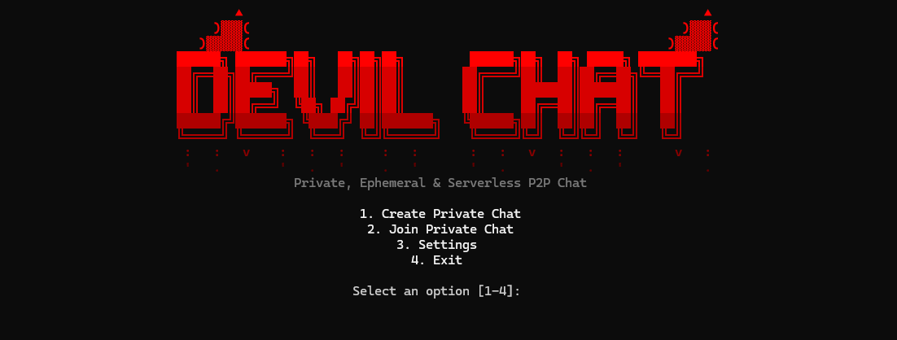

## 📸 DEMO

                                 DEVIL CHAT
                     Private P2P Chat - discord.gg/YB3nGfmpP

[EN] ENGLISH DOCUMENTATION
--------------------------------------------------------------------------------

1. WHAT IS DEVIL CHAT?
DEVIL CHAT is a zero-server, 100% ephemeral, peer-to-peer (P2P) chat system 
built in Python for the Windows CMD / Terminal.
It has:
- NO central server
- NO external API
- NO database (no Redis, Supabase, Firebase, MySQL, MongoDB, SQLite)
- NO user accounts, logins, emails, or phone numbers
- NO message logs, chat history, or permanent storage of conversations.

All messages exist STRICTLY IN RAM while the chat session is active.
As soon as the chat ends or the program closes, all memory is wiped.

2. HOW P2P ARCHITECTURE WORKS & ROOM CODES
In DEVIL CHAT, there is no intermediary server relaying messages.
- The participant who creates the room acts temporarily as the HOST.
- When creating a room, DEVIL CHAT automatically discovers your Public IP
  and generates an encrypted, human-friendly ROOM CODE (e.g., DEVIL-AECC-2RUQ-XTKD...).
- Participants anywhere in the world simply paste this ROOM CODE in
  "2. Join Private Chat" to connect directly to the Host.
- Alternatively, direct IP:PORT connections are also supported.

3. AUTOMATIC UPNP & ROUTER FORWARDING
- DEVIL CHAT includes built-in UPnP (Universal Plug and Play).
- When a room is created, the application automatically requests your home
  router to forward the chat port (default 54321) so peers from other countries
  can connect directly without manual port forwarding.
- When the room closes, DEVIL CHAT automatically releases the port mapping.
- If UPnP is disabled in your router or your ISP uses CGNAT, port forwarding
  or a VPN mesh (like Tailscale) can be used.

4. REALITIES & LIMITATIONS OF P2P NETWORKING
We do NOT pretend that P2P connects magically without network realities:
- LOCAL NETWORK (LAN / Wi-Fi):
  Peers on the same router or Wi-Fi can connect directly using either the
  Room Code or the local IP (e.g., 192.168.1.50:54321).
- INTERNET CONNECTIONS:
  Peers in other countries connect via your Public IP encoded in the Room Code.
- FIREWALL:
  Windows Defender Firewall must allow incoming connections on python.exe or
  the listening port.
- IP EXPOSURE NOTICE:
  In true direct P2P connections, socket endpoints communicate directly.
  This means your IP address is visible to other participants at the TCP level.
  No chat is 100% anonymous over raw P2P.

5. SECURITY & CRYPTOGRAPHY
- Encryption: All messages sent over the wire and in RAM buffers are encrypted
  using authenticated symmetric encryption: AES-256-GCM.
- Integrity: AES-GCM includes a 128-bit authentication tag. Any tampering,
  corruption, or spoofing of ciphertext will immediately fail authentication.
- Room Key: Derived from an optional room passphrase using PBKDF2-HMAC-SHA256
  with 100,000 rounds. If no passphrase is set, an ephemeral room key is used.

6. TEMPORARY IDENTITY
- No permanent identity or account exists.
- Each run generates a random 6-character hex ID (e.g., 7F2A91) in memory.
- Usernames are chosen upon entry and validated to ensure uniqueness only
  during the active session.

7. FIRST RUN & LANGUAGES
- DEVIL CHAT starts automatically in ENGLISH on its first run without any
  intrusive language selection popups.
- You can change the language anytime via "Settings".
- Supports 8 languages:
  1. English (Default)
  2. Portuguese (Português)
  3. Spanish (Español)
  4. French (Français)
  5. German (Deutsch)
  6. Italian (Italiano)
  7. Russian (Русский)
  8. Ukrainian (Українська)

8. COMMANDS
Inside the chat room, the following commands are available:
- /help               Show available commands.
- /members            List connected participants, their temp IDs, and roles.
- /clear              Clear the chat screen locally and re-render header.
- /sair, /leave       Leave the room (asks confirmation [Y/N]).
- /encerrar, /close   (Admin only) Initiate a democratic vote to close room.
- /vote Y or /vote N  Cast your vote during an active vote.

9. INSTALLATION & USAGE
Prerequisites:
- Windows 10 or 11
- Python 3.10+ (Check "Add python.exe to PATH" during installation)

Quick Start:
1. In PowerShell run: .\start.bat (or python devil_chat.py)
   Or double-click start.bat in Windows Explorer.
2. Choose "1. Create Private Chat" to generate a Room Code.
3. Share the Room Code with your friends anywhere in the world!

================================================================================
[PT] DOCUMENTAÇÃO EM PORTUGUÊS

1. O QUE É O DEVIL CHAT?
O DEVIL CHAT é um sistema de chat peer-to-peer (P2P) 100% efêmero e sem servidor,
desenvolvido em Python para o CMD / Terminal do Windows.
Ele possui:
- SEM servidor central
- SEM API externa
- SEM banco de dados (sem Firebase, Supabase, Redis, SQL, etc.)
- SEM contas, cadastros, e-mails ou números de telefone
- SEM histórico de mensagens ou gravação em disco.

Todas as conversas residem EXCLUSIVAMENTE NA MEMÓRIA RAM durante a sessão.
Ao encerrar o chat ou fechar o programa, toda a memória é destruída.

2. ARQUITETURA P2P & CÓDIGO DA SALA (ROOM CODE)
Não há intermediários ou servidores em nuvem.
- Quem cria a sala atua temporariamente como HOST local.
- Ao criar a sala, o programa detecta o seu IP Público da Internet e gera
  automaticamente um CÓDIGO ÚNICO DA SALA (ex: DEVIL-AECC-2RUQ-XTKD...).
- Participantes em qualquer outro país só precisam colar esse código em
  "2. Entrar em Chat Privado". O programa decodifica o destino e conecta direto.
- Conexão direta por IP:PORTA também continua suportada.

3. UPNP AUTOMÁTICO (ABERTURA DE PORTA NO ROTEADOR)
- O DEVIL CHAT possui suporte nativo a UPnP.
- Ao criar a sala, ele pede ao seu roteador para liberar a porta 54321
  automaticamente, permitindo que amigos em outros países se conectem sem
  que você precise configurar o roteador manualmente.
- Ao sair da sala, a liberação de porta é desfeita automaticamente.

4. REALIDADES DE REDE P2P
P2P puro depende da topologia da sua rede:
- REDE LOCAL (LAN / Wi-Fi):
  Participantes na mesma rede conectam-se usando o Código da Sala ou o IP local.
- PELA INTERNET (OUTROS PAÍSES):
  O Código da Sala utiliza o seu IP Público da Internet.
- FIREWALL:
  O Firewall do Windows deve permitir conexões de entrada para o Python.
- EXPOSIÇÃO DO IP:
  Em qualquer conexão P2P direta, o IP da sua máquina fica visível aos participantes
  no nível do socket. Não existe anonimato 100% em P2P direto.

5. SEGURANÇA E CRIPTOGRAFIA
- Criptografia Autenticada: Todas as mensagens são criptografadas com AES-256-GCM.
- Integridade: O AES-GCM inclui tag de autenticação de 128 bits contra adulterações.
- Chave da Sala: Derivada via PBKDF2-HMAC-SHA256 (100.000 iterações) com senha opcional.

6. IDENTIDADE TEMPORÁRIA
- Não há contas permanentes.
- Cada inicialização gera um ID hexadecimal temporário (ex: 7F2A91).
- O username é escolhido ao entrar e validado para ser único na sessão ativa.

7. IDIOMA NA PRIMEIRA EXECUÇÃO
- O programa inicia automaticamente em INGLÊS (ENGLISH) na primeira vez,
  sem questionários invasivos.
- O idioma pode ser alterado em "Settings" para 8 idiomas completos:
  Inglês, Português, Espanhol, Francês, Alemão, Italiano, Russo e Ucraniano.

8. COMANDOS DO CHAT
- /help               Exibe comandos disponíveis.
- /members            Lista participantes conectados, IDs temporários e status.
- /clear              Limpa a tela do chat localmente.
- /sair, /leave       Sai da sala com confirmação [Y/N].
- /encerrar, /close   (Apenas Admin) Inicia votação para fechar a sala.
- /vote Y ou /vote N  Registra seu voto durante votações ativas.

9. COMO EXECUTAR
1. No PowerShell execute: .\start.bat (ou python devil_chat.py)
   Ou dê um duplo clique no arquivo start.bat pelo Explorador de Arquivos.
2. Escolha "1. Create Private Chat".
3. Copie o CÓDIGO DA SALA e envie para seus amigos em qualquer país!
================================================================================
